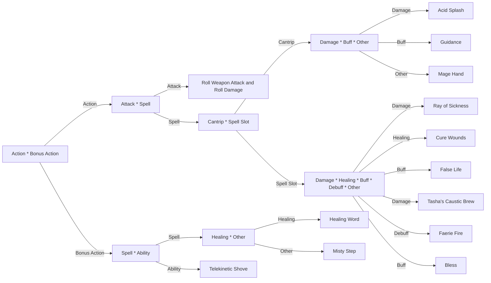

```mermaid
flowchart LR
node3[Action * Bonus Action] --> |Action|node4[Attack Spell]
node4[Attack * Spell] --> |Attack|node5[Roll Weapon Attack and Roll Damage]
node4[Attack * Spell] --> |Spell|node6[Cantrip Leveled Spell]
node6[Cantrip * Spell Slot] --> |Cantrip|node8[Damage Buff Other]
node8[Damage * Buff * Other] --> |Damage|node11[Acid Splash]
node8[Damage * Buff * Other] --> |Buff|node9[Guidance]
node8[Damage * Buff * Other] --> |Other|node10[Mage Hand]
node6[Cantrip * Spell Slot] --> |Spell Slot|node15[Damage Healing Buff Debuff Other]
node15[Damage * Healing * Buff * Debuff * Other] --> |Damage|node18[Ray of Sickness]
node15[Damage * Healing * Buff * Debuff * Other] --> |Healing|node16[Cure Wounds]
node15[Damage * Healing * Buff * Debuff * Other] --> |Buff|node17[False Life]
node15[Damage * Healing * Buff * Debuff * Other] --> |Damage|node22[Tasha's Caustic Brew]
node15[Damage * Healing * Buff * Debuff * Other] --> |Debuff|node23[Faerie Fire]
node3[Action * Bonus Action] --> |Bonus Action|node25[Spell Ability]
node25[Spell * Ability] --> |Spell|node31[Healing Other]
node25[Spell * Ability] --> |Ability|node26[Telekinetic Shove]
node31[Healing * Other] --> |Healing|node29[Healing Word]
node31[Healing * Other] --> |Other|node27[Misty Step]
node15[Damage * Healing * Buff * Debuff * Other] --> |Buff|node33[Bless]
```

